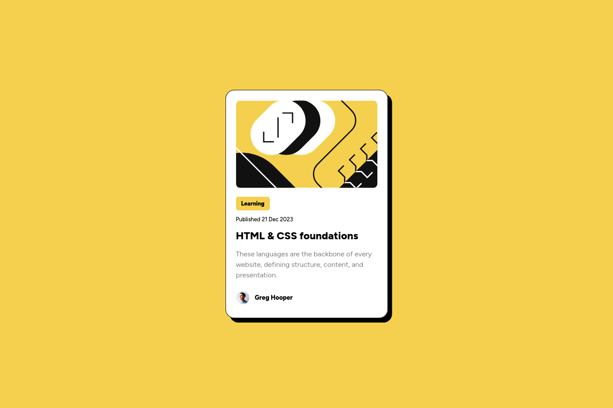
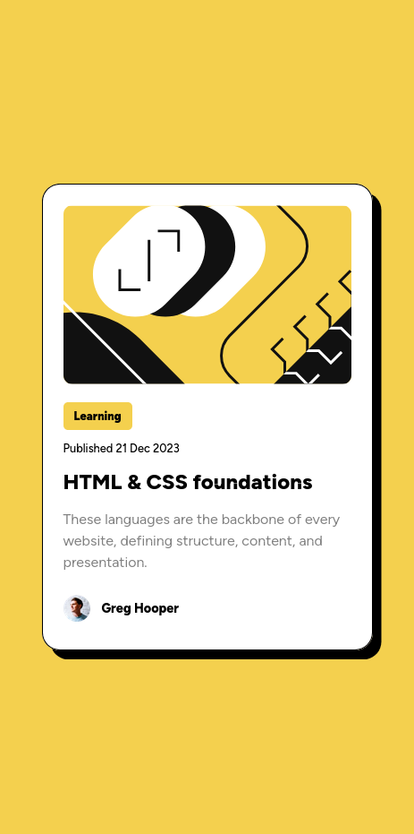

# Frontend Mentor - Blog preview card

This is a solution to the [Blog preview card challenge on Frontend Mentor](https://www.frontendmentor.io/challenges/blog-preview-card-ckPaj01IcS). Frontend Mentor challenges help you improve your coding skills by building realistic projects.

## Table of contents

- [Overview](#overview)
  - [Screenshot](#screenshot)
  - [Links](#links)
- [My process](#my-process)
  - [Built with](#built-with)
- [Author](#author)

## Overview

### Screenshot

#### Desktop version

#### Mobile version

### Links

- Solution URL: [Here.](https://github.com/murilomonte/frontend-mentor/tree/main/blog-preview-card-main)
- Live Site URL: [Here.](https://murilomonte.github.io/frontend-mentor/blog-preview-card-main/)

## My process

### Built with

- Semantic HTML5 markup
- Flexbox

## Author

- Frontend Mentor - [@murilomonte](https://www.frontendmentor.io/profile/murilomonte)
